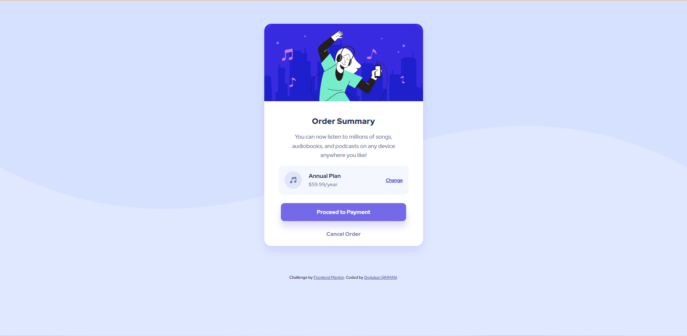
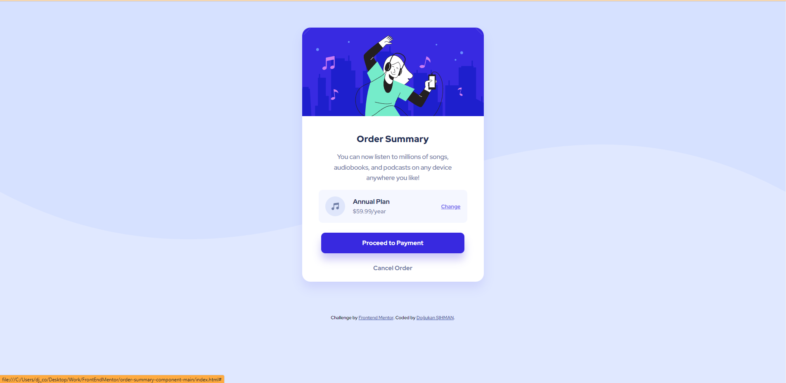
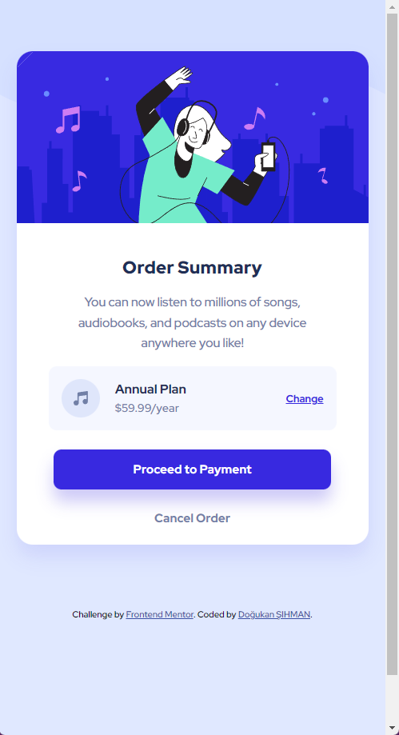

# Frontend Mentor - Order summary card solution

This is a solution to the [Order summary card challenge on Frontend Mentor](https://www.frontendmentor.io/challenges/order-summary-component-QlPmajDUj). Frontend Mentor challenges help you improve your coding skills by building realistic projects.

## Table of contents

- [Overview](#overview)
  - [The challenge](#the-challenge)
  - [Screenshot](#screenshot)
  - [Links](#links)
- [My process](#my-process)
  - [Built with](#built-with)
  - [What I learned](#what-i-learned)
  - [Continued development](#continued-development)
  - [Useful resources](#useful-resources)
- [Author](#author)
- [Acknowledgments](#acknowledgments)

## Overview

### The challenge

Users should be able to:

- See hover states for interactive elements

### Screenshot





### Links

- Solution URL: [https://github.com/dogukan0055/order-summary-card]
- Live Site URL: [https://dogukan0055.github.io/order-summary-card/]

## My process

### Built with

- Semantic HTML5 markup
- CSS custom properties
- Flexbox
- Mobile-first workflow

### What I learned

```html
Usage of main and article and footer tags. Their semantic meanings.
```

```css
.card_link {
    margin-inline-start: auto;
}

I like this css code because using this helped me arrange position of the item.

main {
    display: flex;
    justify-content: center;
    align-items: center;
    margin: 4rem auto;
}

This one is my fav also. It's because made it possible to center it and give some space around it.
```

### Continued development

I'm still working on flexbox and positionings items on a site. Because I'm not very happy with the result, still there's a way to go.

### Useful resources

- [Example resource 1](https://flexbox-guide.vercel.app/) - This site is really handy when you can't figure flexbox out.

## Author

- Website - [Doğukan ŞIHMAN](https://dogukansportfolio.w3spaces.com/)
- Frontend Mentor - [@dogukan055](https://www.frontendmentor.io/profile/dogukan0055)
- Twitter - [@bedavatekme](https://www.twitter.com/bedavatekme)
